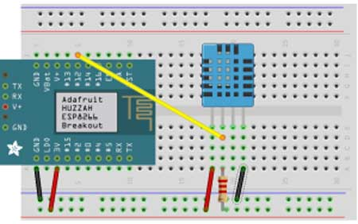

# WiFi Weather Station
WiFi Weather Station is to measure the temperature and humidity in real time with sensors and then transmit the data wirelessly via WiFi to a database and then display the data by various web technologies in a website interface.


### Project Status - in process, last updated 6/4/2017

  - [x]  hardware layout - 6/2/2017
  - [ ]  hardware prototype assembly 
  - [ ]  hardware coding & embedding
  - [ ]  cloud database creation
  - [ ]  configure to send data to database
  - [ ]  test data sending to database  
  - [x]  file and directory structure creation  - 6/4/2017
  - [ ]  website wire framing  
  - [ ]  website coding
  - [ ]  file and directory structure cleanup
  - [ ]  final testing
  
----

### Table of Contents

  -  WiFi Weather Station Description
  -  Features to have 
  -  Features to create if time or for future uses
  -  Hardware used
  -  Technologies used 
  -  How the app should work
  -  How to use this app
  -  File and directory structure
  -  Website resources
  -  Revision history
  
----

### WiFi Weather Station Description
App & Device can be used to monitor weather conditions in agricultural, industrial or commercial applications and can be expanded to monitor numerous other types of data according to the need of the client, market and by sensors available. 

Project is to measure the temperature and humidity in real time with sensors and then transmit the data wirelessly via WiFi to a MySQL, MongoDB or a Cloud based database (like THINGSPEAK, cloud based storage for iot devices) and then display the data with various web technologies in a website interface.


----

### Features to have:
- MySQL, MongoDB or a Cloud based data logging of temperature & humidity via WiFi
- Results viewable by charts, tables and/or graphs in a website interface
- Real time  temperature and humidity monitoring as polled from sensor 
- Weather forcasting provided by 3rd party source by API
- Battery powered, portable device


----

### Features to create if time or for future uses:
- data logging of additional sensors (for Agricultural, industrial or commercial Applications)
- Device location via GPS
- Twitter alerts - low/high temperature or humidity, low battery level, ect...
- Solar powered battery source


----

### Hardware Used

  - Adafruit Feather HUZZAH ESP8266 development board with built in USB and battery charging 
  - DHT-11 digital temperature and humidity sensor  
  
  
  WiFi Weather Station Breadboard Layout  

	

----

### Technologies Used

Description of technologies used 


----

### How The App Should Work

Description of how the app should work


----

### How to use this app

Description of how to use the app


----

### File and directory structure

```


```


----
### Website Resources 

Links to the resources used in the creation of this app


----
### Revision History 

Description of revisions made to the app

