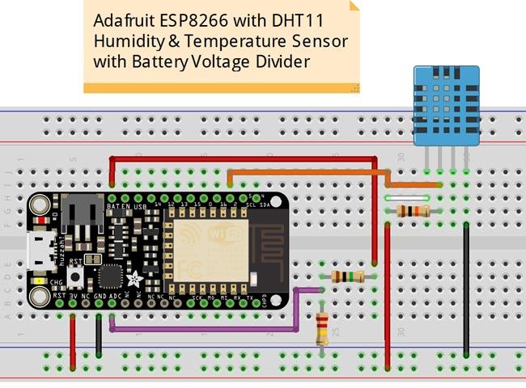

# WiFi Weather Station
WiFi Weather Station is to measure the temperature and humidity in real time with sensors and then transmit the data wirelessly via WiFi to Firebase, a real-time cloud database, and then display the data by various web technologies in a website interface.


### Project Status - in process, last updated 7/12/2017

  - [x]  hardware layout - 6/2/2017
  - [x]  hardware prototype assembly - 6/5/2017
  - [x]  hardware coding & embedding - updated 7/12/17
  - [x]  cloud database creation - 7/9/17
  - [x]  configure to send data to database - updated 7/12/17
  - [x]  testing data sending to database - updated 7/12/17
  - [x]  file and directory structure creation  - updated 7/5/2017
  - [x]  website wire framing - 7/5/17
  - [ ]  website coding - In process 7/12/17
  - [ ]  file and directory structure cleanup
  - [ ]  final testing
  
----

### Table of Contents

  -  WiFi Weather Station Description
  -  Features to have 
  -  Features to create if time or for future uses
  -  Hardware used
  -  Technologies used 
  -  How the app should work
  -  How to use this app
  -  File and directory structure
  -  Revision history
  
----

### WiFi Weather Station Description
App & Device can be used to monitor weather conditions in agricultural, industrial or commercial applications and can be expanded to monitor numerous other types of data according to the need of the client, market and by sensors available. 

Project is to measure the temperature and humidity in real time with sensors and then transmit the data wirelessly via WiFi to Firebase, a real-time cloud database, and then display the data with various web technologies in a website interface.


----

### Features to have:
- Use Firebase (a Backend-as-a-Service cloud storage), to store data on its real-time database to log data of temperature & humidity via WiFi
- Results viewable by charts, tables and/or graphs in a website interface
- Real time  temperature and humidity monitoring as polled from sensor 
- Weather forecasting provided by 3rd party source by API
- Battery powered, portable device


----

### Features to create if time or for future uses:
- Data logging of additional sensors (for Agricultural, industrial or commercial Applications)
- Device location via GPS
- Solar powered battery source to extend battery life


----

### Hardware For Project

Parts Used

  - Adafruit Feather HUZZAH ESP8266 development board with built in USB and battery charging 


  - DHT-11 digital temperature and humidity sensor


  - 10K Ohm Resistor, 5%, 1/4 watt Color code: Brown, Black, Orange, Gold  

  
  
  WiFi Weather Station Breadboard Layout  

	
Code used for programming the Adafruit Feather HUZZAH ESP8266 board is located in the directory  [feather_huzzah_esp8266_code](https://github.com/DKMitt/wifi_ws/tree/master/feather_huzzah_esp8266_code). 

* __Definition of Code__
  * [weatherStationESP8266.ino](<https://github.com/DKMitt/wifi_ws/blob/master/feather_huzzah_esp8266_code/weatherStationESP8266.ino>)  -  Used to test hardware was setup correctly, sends data to serial monitor. 
  * [weatherStationESP8266-ep.ino](<https://github.com/DKMitt/wifi_ws/blob/master/feather_huzzah_esp8266_code/weatherStationESP8266-ep.ino>)  -  Used to send data via WiFi to ThingSpeak to verify that data was sending out to a database and receiving data in
  * [wsESP8266-DHT11-Firebase.ino]()  -  Used to send data via WiFi to Firebase database


I will not be covering how to or about the code portion of the Adafruit Feather HUZZAH ESP8266 board in this description but may at some point include a separate write up on how to do that. 

Below in RESOURCES you will find links to where i sourced information used to create the code used for this project.
	
----

### Technologies Used

Description of technologies used 


----

### How The App Should Work

Description of how the app should work


----

### How to use this app

Description of how to use the app


----

### File and directory structure

```
.
├── feather_huzzah_esp8266_code
│   │
│   ├── weatherStationESP8266.ino
│   │
│   ├── weatherStationESP8266-ep.ino
│   │
│   └── wsESP8266-DHT11-Firebase.ino
│ 
├── public
│   │
│   ├── assets
│   │   │
│   │   └── img
│   │       │
│   │       ├── adafruit-feather-huzzah-esp8266.jpg
│   │       │
│   │       ├── DHT11.jpg
│   │       │
│   │       ├── ESP8266-DHT11.jpg
│   │       │
│   │       ├── single10kOhm.jpg
│   │       │
│   │       └── smart-farm.jpg
│   │
│   ├── favicon.ico
│   │
│   ├── index.html
│   │
│   └── manifest.json
│
├── src
│   │
│   ├── About.js
│   │
│   ├── App.css
│   │
│   ├── App.js
│   │
│   ├── App.test.js
│   │
│   ├── Forecast.jss
│   │
│   ├── History.js
│   │
│   ├── Home.js
│   │
│   ├── index.css
│   │
│   ├── index.js
│   │
│   ├── Location.js
│   │
│   └── registerServiceWorker.js
│ 
├── .gitignore
│
├── package.json
│
├── package-lock.json
│
└── README.md            
```
----
### Revision History 

Description of revisions made to the app

