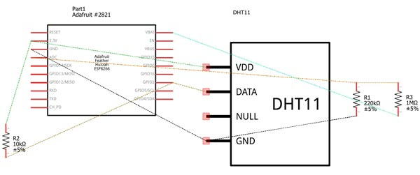

# WiFi Weather Station
WiFi Weather Station is to measure the temperature and humidity in real time with sensors and then transmit the data wirelessly via WiFi to Firebase, a real-time cloud database, and then display the data by various web technologies in a website interface.


### Project Status - Working, last updated 7/19/2017

----

### Table of Contents

  -  WiFi Weather Station Description
  -  Features to have 
  -  Features to create if time or for future uses
  -  Hardware for project
  -  Schematic of layout
  -  Technologies used for website 
  -  Dependecies
  -  How to use this app
  -  File and directory structure
  -  Revision history
  
----

### WiFi Weather Station Description
App & Device can be used to monitor weather conditions in agricultural, industrial or commercial applications and can be expanded to monitor numerous other types of data according to the need of the client, market and by sensors available. 

Project is to measure the temperature and humidity in real time with sensors and then transmit the data via WiFi to Firebase, a real-time cloud database, and then display the data with various web technologies in a website interface.


----

### Features to have:
- Use Firebase (a Backend-as-a-Service cloud storage), to store data on its real-time database to log data of temperature & humidity via WiFi
- Viewable results by a website interface
- Real time temperature and humidity monitoring as polled from sensor 
- Battery powered, portable device


----

### Features to create if time or for future uses:
- Data logging of additional sensors (to display for the use in a variety of industries such as Agricultural, industrial or commercial Applications)
- Weather forecasting provided by 3rd party source by API
- Device location via GPS
- Solar powered battery source to extend battery life


----

### Hardware for project

Parts Used

  - Adafruit Feather HUZZAH ESP8266 development board with built in USB and battery charging  [click for image](public/assets/img/adafruit_feather_Huzzah_ESP8266_v1_1.jpg)


  - DHT-11 digital temperature and humidity sensor  [click for image](public/assets/img/DHT11-Blowup.png)


  - 10K Ohm Resistor, 5%, 1/4 watt, Color code: Brown, Black, Orange, Gold   [click for image](public/assets/img/single10kOhm.jpg)


  
  
  WiFi Weather Station Breadboard Layout  


### Schematic of layout


Code used for programming the Adafruit Feather HUZZAH ESP8266 board is located in the directory  [feather_huzzah_esp8266_code](https://github.com/DKMitt/wifi_ws/tree/master/feather_huzzah_esp8266_code). 

* __Definition of Code__
  * [weatherStationESP8266.ino](https://github.com/DKMitt/wifi_ws/blob/master/feather_huzzah_esp8266_code/weatherStationESP8266.ino)  -  Used to test hardware was setup correctly, sends data to serial monitor. 
  * [weatherStationESP8266-ep.ino](https://github.com/DKMitt/wifi_ws/blob/master/feather_huzzah_esp8266_code/weatherStationESP8266-ep.ino)  -  Used to send data via WiFi to ThingSpeak to verify that data was sending out to a database and receiving data in
  * [wsESP8266-DHT11-Firebase.ino](https://github.com/DKMitt/wifi_ws/blob/master/feather_huzzah_esp8266_code/wsESP8266-DHT11-Firebase.ino)  -  Used to send data via WiFi to Firebase database to verify that data was sending out to Firebase and receiving data in


I will not be covering how to or about the code portion of the Adafruit Feather HUZZAH ESP8266 board in this description but may at some point include a separate write up on how to do that. 


	
----

### Technologies used for website

Description of technologies used to develop this app.

- REACT Router 4.1.1
- REACT.JS based using [create-react-app](https://github.com/facebookincubator/create-react-app), currently it is a thin layer on top of many amazing community projects, such as:

- webpack with webpack-dev-server, html-webpack-plugin and style-loader
Babel with ES6 and extensions used by Facebook (JSX, object spread, class properties)

- Autoprefixer

- Jest

- ESLint
- All of them are transitive dependencies of the provided npm package.

### Dependecies
    firebase: 4.1.3,
    react: 15.6.1,
    react-dom: 15.6.1,
    react-router: 4.1.1,
    react-router-dom: 4.1.1
    
----


### How to use this app

Description of how to use the app

To start the app use the following command

  "npm start"   - this Runs the app in development mode.

  Open http://localhost:3000 to view it in the browser.


----


### File and directory structure

```
.
├── feather_huzzah_esp8266_code
│   │
│   ├── weatherStationESP8266.ino
│   │
│   ├── weatherStationESP8266-ep.ino
│   │
│   └── wsESP8266-DHT11-Firebase.ino
│ 
├── public
│   │
│   ├── assets
│   │   │
│   │   └── img
│   │       │
│   │       ├── adafruit_feather_Huzzah_ESP8266_v1_1.jpg
│   │       │
│   │       ├── adafruit-feather-huzzah-esp8266.jpg
│   │       │
│   │       ├── DHT11-Blowup.png
│   │       │
│   │       ├── ESP8266-DHT11.jpg
│   │       │
│   │       ├── schematic-1.jpg
│   │       │
│   │       ├── single10kOhm.jpg
│   │       │
│   │       ├── smart-farm.jpg
│   │       │
│   │       ├── wifiws-data.jpg
│   │       │
│   │       └── wifiws-home.jpg
│   │
│   ├── favicon.ico
│   │
│   ├── index.html
│   │
│   └── manifest.json
│
├── src
│   │
│   ├── img
│   │   │
│   │   ├── ESP8266-DHT11.jpg
│   │   │
│   │   └── smart-farm.jpg
│   │
│   ├── manifest.json
│   │
│   ├── About.js
│   │
│   ├── App.css
│   │
│   ├── App.js
│   │
│   ├── App.test.js
│   │
│   ├── Data.jss
│   │
│   ├── Home.js
│   │
│   ├── index.css
│   │
│   ├── index.js
│   │
│   └── registerServiceWorker.js
│ 
├── .gitignore
│
├── package.json
│
├── package-lock.json
│
└── README.md            
```
----
### Revision History 

Description of revisions made to the app - Working, last updated 7/19/2017

  - [x]  hardware layout - 7/2/2017
  - [x]  hardware prototype assembly - 7/5/2017
  - [x]  hardware coding & embedding - updated 7/19/17
  - [x]  cloud database creation - 7/9/17
  - [x]  configure to send data to database - updated 7/19/17
  - [x]  testing data sending to database - updated 7/19/17
  - [x]  file and directory structure creation  - updated 7/5/2017
  - [x]  website wire framing - 7/5/17
  - [x]  website coding - updated 7/19/17
  - [x]  file and directory structure cleanup - updated 7/19/17
  - [x]  final testing - updated 7/19/17
